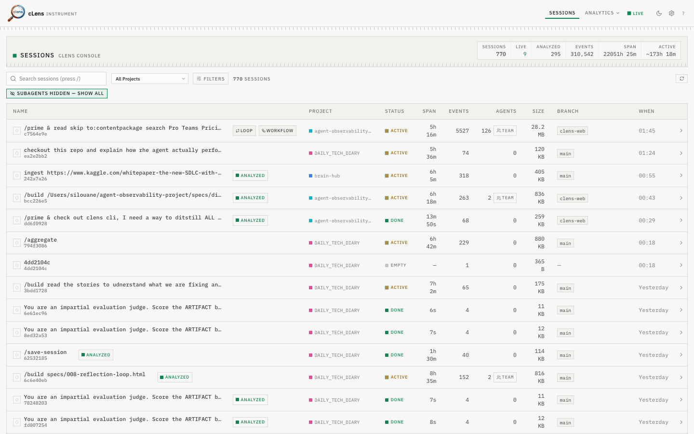
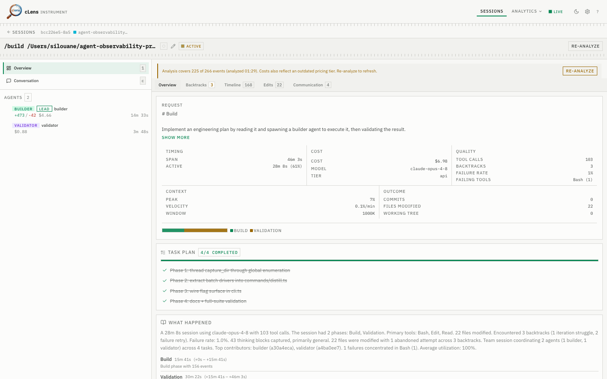

# cLens — Session Observability for Claude Code

[](https://www.npmjs.com/package/clens)
[](LICENSE)
[](https://github.com/silouone/clens/actions/workflows/ci.yml)

**Local-first session capture and analysis for Claude Code agents.** See what your agent actually did — every tool call, backtrack, decision, and reasoning step — then explore it all in a browser dashboard. Zero network, zero server, zero telemetry.

## 30-second quickstart

```sh
npm install -g clens       # or: bun install -g clens
```



```sh
clens init                 # 1. install hooks into this project
# ... use Claude Code normally ...
clens distill --last       # 2. analyze your latest session
clens web                  # 3. open the dashboard in your browser
```

That's it. `clens init` wires the capture hooks, your sessions land as local JSONL, and `clens web` launches the full dashboard at `http://127.0.0.1:3700`. Prefer the terminal? `clens explore` opens the interactive TUI instead.

## Web Dashboard

`clens web` serves a browser dashboard for everything cLens captures — session list, per-session detail, multi-agent trees, decision and backtrack timelines, edit chains, plan drift, and cross-session insights. The web server is bundled into the CLI binary at build time, so npm consumers need nothing extra to run it.



```sh
clens web                      # launch on http://127.0.0.1:3700, opens your browser
clens web --port 8080          # custom port
clens web --no-open            # don't auto-open the browser
clens web --global             # aggregate sessions across all your repos
```

The dashboard is served locally and gated behind a per-launch token printed to your terminal — nothing is exposed to the network and no data leaves your machine. A per-session Config / Environment panel surfaces the git context, model, and pricing tier captured for each run.

> Honest by design: cost and token figures are **mostly estimated** (cache reads dominate real usage and aren't always itemized), "outcome" is derived from the session's completion flag plus files modified (not from commits), and "decisions" are **structural** signals (timing gaps, phase boundaries, tool pivots) rather than semantic judgments. cLens measures; it doesn't editorialize.

## What it does

cLens hooks into Claude Code to capture complete session traces as local JSONL files. Every tool call, session lifecycle event, and agent message is appended to a flat file in your project — no network, no server, no external dependencies. After a session, the `distill` command runs 20+ extractors to surface decision points, backtracks, reasoning patterns, edit chains, plan drift, multi-agent communication, and more for post-hoc analysis in the CLI, TUI, or web dashboard.

### Key capabilities

- **Session capture** — zero-config hooks, ~2ms overhead per event
- **Web dashboard** — `clens web` for a full browser UI over every session
- **Backtrack detection** — find where agents reversed course and why
- **Decision analysis** — trace structural decision points through agent reasoning
- **Edit chains** — link thinking blocks to the code changes they produced
- **Plan drift** — compare intended spec vs actual execution
- **Multi-agent tracing** — communication graphs, team metrics, agent trees
- **Interactive TUI** — explore sessions with keyboard-navigable tabs

## Prerequisites

[Bun](https://bun.sh) >= 1.0

## Quick Start

```sh
npm install -g clens       # or: bun install -g clens
```

Then in any project:

```sh
clens init                          # install hooks (local, per-project)
clens init --global                 # or install hooks globally (all projects)
# use Claude Code normally
clens list                          # see captured sessions
clens distill --last                # analyze latest session
clens distill --global              # analyze every session across all your repos
clens what --last                   # quick summary: request, outcome, cost
clens report --last                 # detailed report
clens report --last backtracks      # drill into backtracks
clens agents --last                 # agent overview
clens web                           # browser dashboard
clens explore                       # interactive TUI explorer
```

## CLI Reference

### Setup

| Command | Description |
|---|---|
| `init` | Install hooks into `.claude/settings.json` (local, per-project) |
| `init --global` | Install hooks globally for all projects |
| `init --remove` | Remove hooks from all active tiers (`--legacy` to also clean legacy hooks) |
| `init --status` | Show installation status across all tiers |
| `init plugin` | Install agentic plugin into `~/.claude/` |
| `init plugin --remove` | Remove agentic plugin |
| `init plugin --dev` | Dev mode (symlink from source) |
| `config` | View current configuration |
| `config --pricing <tier>` | Set pricing tier (`api`, `max`, or `auto`) |
| `config --global-mode <mode>` | Set discovery mode: `repository` (git root) or `project` (each `.clens/`) |

### Sessions

| Command | Description |
|---|---|
| `list` | List captured sessions with duration, events, team, type, status |
| `list --global` | List sessions across all registered projects |
| `name <id> [label]` | Set/clear a session's label and color (`--color <c>`, `--clear`; no args prints current) |
| `distill [id]` | Extract insights: backtracks, decisions, file map, reasoning, edit chains |
| `distill --global` | Distill every session across all registered projects (incremental; `--force` to re-distill) |
| `what [id]` | Quick summary: request, outcome, cost, issues, files changed |
| `report [id]` | Session summary — backtrack severity, high-risk files, top tools |
| `report [id] backtracks` | Backtrack analysis (add `--detail` for per-backtrack breakdown) |
| `report [id] drift [spec]` | Plan drift analysis (spec vs actual files) |
| `report [id] reasoning` | Reasoning analysis (add `--full` for full text, `--intent` to filter) |
| `agents [id]` | Agent table overview (or `agents [id] <agent>` for detail) |
| `agents [id] --comms` | Communication timeline |
| `web` | Launch the browser dashboard (`--port`, `--no-open`, `--global`) |
| `explore` | Interactive TUI explorer (dynamic tabs, scroll, keyboard nav) |

### Data

| Command | Description |
|---|---|
| `clean <id>` / `clean --last` | Remove **one** session's raw data (preserves distilled artifacts) |
| `clean --all` | **Destructive:** remove the raw data for **every** session in this project. Prompts for confirmation; requires `--yes` when non-interactive. There is no undo. |
| `export [id]` | Export session as a `.zip` archive |

> ⚠️ `clean` and `clean --all` permanently delete raw session JSONL for the whole project. `clean --all` always asks before deleting in a terminal and refuses to run non-interactively unless you pass `--yes`. Distilled artifacts (`.clens/distilled/`) are always preserved. By default, sessions that have **not** been distilled yet are skipped so you don't lose un-analyzed raw data; pass `--force` to delete those too.

## Flags

| Flag | Applies to | Description |
|---|---|---|
| `--last` | `distill`, `report`, `agents`, `what`, `clean`, `export` | Use most recent session |
| `--json` | `list`, `distill`, `report`, `agents`, `what`, `config`, `name` | Output structured JSON |
| `--all` | `distill`, `clean` | Apply to all sessions in the project |
| `--global` | `init`, `list`, `distill`, `what`, `web` | Operate across all registered projects (for `init`, install hooks globally) |
| `--deep` | `distill` | Enrich with git history and unified diffs (spawns git) |
| `--force` | `clean`, `distill` | For `clean`, also delete not-yet-distilled raw sessions; for `distill`, re-distill fresh sessions |
| `--yes`, `-y` | `clean` | Skip the confirmation prompt (required for `clean --all` when non-interactive) |
| `--detail` | `report backtracks` | Per-backtrack breakdown |
| `--full` | `report reasoning` | Show full thinking text |
| `--intent <type>` | `report reasoning` | Filter by intent type |
| `--comms` | `agents` | Show communication timeline |
| `--port <n>` | `web` | Dashboard port (default 3700) |
| `--no-open` | `web` | Don't auto-open the browser |
| `--pricing <tier>` | `distill`, `what`, `config` | Pricing tier: `api`, `max`, or `auto` |
| `--color <c>` | `name` | Session color flag |
| `--clear` | `name` | Clear a session's label and color |
| `--global-mode <m>` | `config` | Discovery mode: `repository` or `project` |
| `--remove` | `init` | Remove hooks/plugin |
| `--status` | `init` | Show installation status |
| `--dev` | `init plugin` | Dev mode (symlink from source) |
| `--legacy` | `init --remove` | Also remove legacy hooks |

## Why cLens

| | cLens | OTel-based tools | Usage trackers | Session viewers |
|---|---|---|---|---|
| Capture method | Native hooks (2ms) | Proxy/middleware | Log parsing | Transcript reading |
| Backtrack detection | 20+ extractors | -- | -- | -- |
| Decision analysis | Built-in | -- | -- | -- |
| Edit chain tracking | Built-in | -- | -- | -- |
| Plan drift analysis | Built-in | -- | -- | -- |
| Multi-agent support | Full (comms, trees) | Partial | -- | -- |
| Network required | No | Yes | No | No |
| Explorers | TUI + local web dashboard | Dashboard | -- | Web UI |
| Self-analysis plugin | Yes (agents analyze own sessions) | -- | -- | -- |

## How it works

Two-layer architecture:

**Layer 1 -- Hooks**: Claude Code fires hooks on every tool call, session start/end, and agent lifecycle event. cLens registers a compiled binary as the hook handler. Each invocation appends a structured event to a JSONL file under `.clens/sessions/`. Target: ~2ms per invocation.

**Layer 2 -- Transcript Enrichment**: At distill time, the Claude Code transcript is parsed for thinking blocks and user messages, providing context for why the agent made the choices it did.

The `distill` command runs 20+ pure extractors covering stats, backtracks, decisions, file-map, git-diff, reasoning, user-messages, summary, timeline, plan-drift, edit-chains, active-duration, aggregate, comm-graph, comm-sequence, agent-tree, agent-distill, agent-enrich, team, decisions-team, summary-team, journey, and more. Output is written as structured JSON to `.clens/distilled/`.

## Agentic Plugin

cLens ships an agentic plugin that integrates directly into Claude Code, giving agents the ability to analyze their own sessions.

```sh
clens init plugin          # install into ~/.claude/
clens init plugin --dev    # dev mode (symlink from source)
clens init plugin --status # check installation state
```

The plugin provides:

- **5 skills**: session-analysis, session-report, session-compare, backtrack-analysis, journey-report
- **3 slash commands**: `/session-report`, `/session-compare`, `/backtrack-analysis`
- **1 agent**: session-analyst

## Session data

```
.clens/
  sessions/    Raw JSONL event files (one per session)
  distilled/   Analyzed JSON output from distill
  exports/     Archived session bundles
```

## Privacy

All data is local. No network calls. No telemetry. Full tool call payloads -- including arguments and outputs -- are written to JSONL. Be aware of this if sessions involve credentials, API keys, or sensitive file contents. The `clens web` dashboard is served only on localhost and gated by a per-launch token.

## Development

This is a Bun workspace monorepo (`packages/cli` + `packages/web`).

```sh
bun run dev       # launch the full dashboard (API + Vite) with one command
bun test          # run the test suite
bun run typecheck
bun run build
```

### Running the dashboard locally

`bun run dev` starts a single **supervised** launcher (`scripts/dev.ts`) that owns
the whole process tree:

- It is the sole **port authority** — it picks a free API port and a free web port,
  so two `bun run dev` instances never collide. If 3117/3701 are busy it transparently
  moves to the next free pair.
- The Vite proxy is wired to whatever API port was actually bound (`CLENS_API_PORT`),
  and the API binds that port in strict mode or fails loudly — they can never drift apart.
- Ctrl-C reaps the **entire group**, including the `esbuild` daemons Vite spawns —
  no orphaned background processes left behind.
- It health-checks the API, then opens your browser at the web URL automatically.

```sh
bun run dev                 # global mode (all repos), auto-open browser
bun run dev --local         # current project only
bun run dev --no-open       # don't open a browser
bun run dev --api-port 4000 --web-port 4001   # seed specific ports (still auto-bumps if busy)
bun run dev:clean           # kill stale orphan dev processes first, then launch
bun run dev:doctor          # report/clean orphaned dev processes (see below)
```

Escape hatches (the old split commands) are still available if you want to run the
halves in separate terminals: `bun run dev:api`, `bun run dev:api:global`, `bun run dev:web`.

### Orphan doctor

If a previous dev session left processes behind (or you hit the macOS "unkillable
esbuild" state where daemons wedge in uninterruptible-wait), run:

```sh
bun run dev:doctor
```

It prints a table of every dev-server process (pid, type, port, state, killable?),
cleans the killable ones, and tells you plainly if any are **unkillable** — those
cannot be signalled away and require a **reboot** to clear.

### Production port behaviour (`clens web`)

`clens web` prefers **3700** and **auto-bumps** to the next free port if it's busy,
printing a note (`port 3700 busy → started on 3701`). To force an exact port and fail
loudly instead of bumping, set `CLENS_PORT_STRICT=1`:

```sh
clens web --port 8080                 # prefer 8080, bump if busy
CLENS_PORT_STRICT=1 clens web --port 8080   # bind exactly 8080 or fail
```
